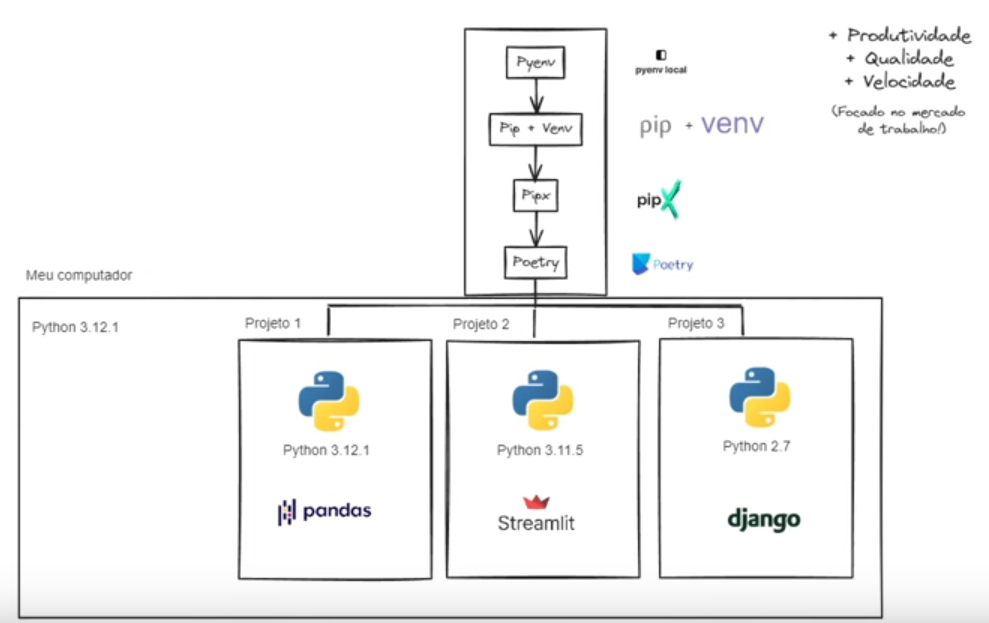
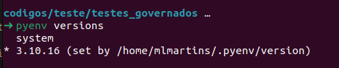
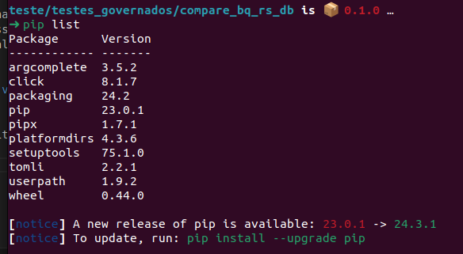
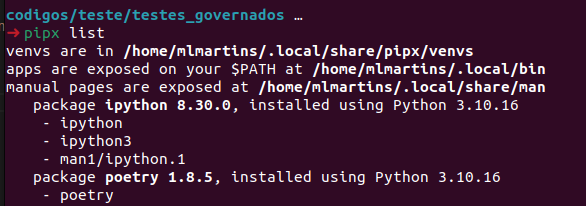

- [Objetivos](#objetivos)
- [Preparando zsh](#preparando-zsh)
  * [Instalando zsh](#instalando-zsh)
  * [Instalando o Oh-My-ZSH](#instalando-o-oh-my-zsh)
  * [Instalando plugins](#instalando-plugins)

<small><i><a href='http://ecotrust-canada.github.io/markdown-toc/'>Table of contents generated with markdown-toc</a></i></small>

# Objetivos

Esse repositorio tende a facilitar minha vida com o start de configurações para conseguir trabalhar


# Preparando zsh

zsh é igual bash ou o proprio sh mas tem uns plugins que ajudam.

# Instalando zsh

Observações:
- O mac não precisa instalar.
- No windows tu tem que instalar no WSL (Windows Subsystem Linux)

```sh
sudo apt install zsh -y
```

# Instalando o Oh-My-ZSH

Essa é a extensão que deixa as paradas bonias.
O link para a pagina de instalação é esse: https://ohmyz.sh/#install

Comando direto porque sou preguiçoso

```sh
sh -c "$(curl -fsSL https://raw.github.com/ohmyzsh/ohmyzsh/master/tools/install.sh)"
```

# Instalando plugins

## Systax Highlight

O link desse puglin é esse: [zsh-syntax-highlighting](https://github.com/zsh-users/zsh-syntax-highlighting/blob/master/INSTALL.md)

Codigo para preguiçoso.

**OBS: pode estar desatualizado**

1. Clone this repository in oh-my-zsh's plugins directory:

    ```zsh
    git clone https://github.com/zsh-users/zsh-syntax-highlighting.git ${ZSH_CUSTOM:-~/.oh-my-zsh/custom}/plugins/zsh-syntax-highlighting
    ```

2. Activate the plugin in `~/.zshrc`:

    ```zsh
    plugins=( [plugins...] zsh-syntax-highlighting)
    ```

3. Restart zsh (such as by opening a new instance of your terminal emulator).


## Auto Suggestions

O link desse puglin é esse: [zsh-autosuggestions](https://github.com/zsh-users/zsh-autosuggestions/blob/master/INSTALL.md)

Codigo para preguiçoso.

**OBS: pode estar desatualizado**

1. Clone this repository into `$ZSH_CUSTOM/plugins` (by default `~/.oh-my-zsh/custom/plugins`)

    ```sh
    git clone https://github.com/zsh-users/zsh-autosuggestions ${ZSH_CUSTOM:-~/.oh-my-zsh/custom}/plugins/zsh-autosuggestions
    ```

2. Add the plugin to the list of plugins for Oh My Zsh to load (inside `~/.zshrc`):

    ```sh
    plugins=( 
        # other plugins...
        zsh-autosuggestions
    )
    ```

3. Start a new terminal session.

## Thema

Tem um tema que eu não gosto muito mas a documentação dele é boa. Chama SpaceshipZSH ele é bem pesado por isso eu não gosto muito. O link dele é o seguinte: [spaceship-promp](https://github.com/spaceship-prompt/spaceship-prompt)

Os comandos para aderir qualquer tema é esse:

- Clone this repo (aqui é so colocar o arquivo do seu thema na pasta correta ):

```zsh
# Exemplo
git clone https://github.com/arquivo_thema_x "$ZSH_CUSTOM/themes/thema_x" --depth=1

# Exemplo concreto
git clone https://github.com/spaceship-prompt/spaceship-prompt.git "$ZSH_CUSTOM/themes/spaceship-prompt" --depth=1
```

- Symlink `spaceship.zsh-theme` to your oh-my-zsh custom themes directory:

```zsh
ln -s "$ZSH_CUSTOM/themes/spaceship-prompt/spaceship.zsh-theme" "$ZSH_CUSTOM/themes/spaceship.zsh-theme"
```

- Set `ZSH_THEME="spaceship"` in your `.zshrc`.

Atualmente estou usando um tema padrão que é o `ZSH_THEME="gnzh"`

4. Plugin de gestão de comandos antigos

```zsh
git clone --depth 1 https://github.com/junegunn/fzf.git ~/.fzf
~/.fzf/install

# Organizando ambiente python




# Sequencia

- pyenv: gestão das versões do python
- pip + venv: gestão de pacotes
- pipx: gestão de pacotes a nivel de usuario
- poetry: gestão de deploy

Nesse tutorial a gente usou essa [documentação](https://gist.github.com/luzfcb/ef29561ff81e81e348ab7d6824e14404) como referencia mas ela pode estar desatualizada.

## pyenv

Primeiro, atualize a lista de pacotes:

```zsh
sudo apt-get update
```

Instale os pacotes básicos

```zsh
sudo apt-get install -y build-essential libssl-dev zlib1g-dev libbz2-dev libreadline-dev libsqlite3-dev wget curl llvm gettext libncurses5-dev tk-dev tcl-dev blt-dev libgdbm-dev git python2-dev python3-dev aria2 lzma liblzma-dev
```

depois:

```zsh
curl -L https://raw.githubusercontent.com/pyenv/pyenv-installer/master/bin/pyenv-installer | bash
```

logo após, edite o arquivo .bashrc localizado na "Pasta Pessoal" ou Home do seu usuário, com o comando:

```zsh
code ~/.bashrc
# coloque o comando abaixo nos 2 arquivos (não sei o pq hahah)
code ~/.zshrc

```

adicione esses comandos ao final do arquivo:

```zsh
export PYTHON_BUILD_ARIA2_OPTS="-x 10 -k 1M"

export PATH="${HOME}/.pyenv/bin:$PATH"
eval "$(pyenv init --path)"
eval "$(pyenv init -)"
eval "$(pyenv virtualenv-init -)"
```

Você pode ver as versões do interpretador Python que podem ser instalados com o comando:

```zsh
# mostra todas as versões python disponiveis
pyenv install -l
```

Se a versão do interpretador Python que você quer instalar não aparecer na lista, tente atualizar da base de dados de versões do interpretadores rodando pyenv

```zsh
pyenv update
```

Instale o pyenv (vou usar a versão 3.5.1 nos exemplos a seguir, mas você pode usar qualquer uma das versões listadas ao executar pyenv install -l )

```zsh
pyenv install 3.10.16
```

Com o comando abaixo é possivel ver quais a versões instaladas na sua maquina

```zsh
pyenv versions
```



Setar o `pyenv` global

```zsh
# fora de alguma pasta ele ira usar essa versão
pyenv global 3.10.16

# Dentro de uma pasta usar o comando abaixo
# ele criará um arquivo .python-version com a versão daquela pasta 
pyenv local 3.10.16
```


## pipx

A ideia aqui é apenas ter no global os pacotes que precisamos. Para isso vamos usar esse comando para limpar seu pip local.

```zsh
# desisntalar todos os pacotes
pip freeze | grep -v "^-e" | xargs pip uninstall -y 

# intalar o pipx
pip install pipx
```

Feito isso o gabarito rodando o pip liste é o abaixo:




Então no global ter apenas o ipython e o poetry instalado
```zsh
pipx install ipython
pipx install poetry
```
Verificar se os pacotes instalados estão na sua versão global.


## Poetry

Poetry vai fazer a gestão de dependencias e criar a venv

comandos:
```zsh
# Configura o poetry para gerir a venv
poetry config virtualenvs.in-project true

# Criar o projeto poetry
poetry new compare_bq_rs_db

# Cria o arquivo para setar a versão default do python
pyenv local 3.10.16

# Cria a venv com a versão especificada
poetry env use 3.10.16

```
